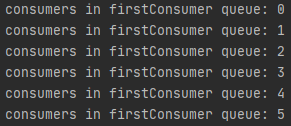
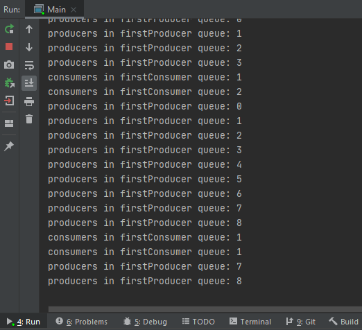
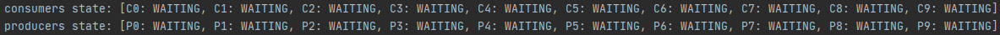

## Problem producentów i konsumentów - zagłodzenie i zakleszenie.

### Zagłodzenie:

W rozważanym przez nas problemie zagłodzenie nastąpi, gdy ciąg niefortunnych zdarzeń doprowadzi do sytuacji, w której dany producent/konsument nie będzie mógł wyprodukować/skonsumować zadeklarowanej przez siebie porcji danych.

- w wersji programu z hasWaiters() może dojść do zagłodzenia, gdyż w wyniku błędnej sygnalizacji w kolejce firstProducer/firstConsumer może czekać wiele wątków - wśród nich może znajdować się taki który przy każdym wzbudzeniu chce wyprodukować/skonsumować za dużą porcję danych co będzie skutkowało jego ponownym uśpieniem 

##### przykład pojawienia się kilku konsumentów w kolejce firstConsumer:


- w wersji programu z booleanem nie może dojść do zagłodzenia, gdyż mamy gwarancję że w kolejce firstProducer/firstConsumer znajduje się maksymalnie jeden proces który oczekuje na dogodne warunki do zakończenia działania (przy bezpiecznym rozmiarze bufora takie zakończenie zawsze nastąpi)


### Zakleszczenie: 
W rozważanym przez nas problemie zakleszczenie nastąpi, gdy ciąg niefortunnych zdarzeń doprowadzi do sytuacji, w której wszyscy producenci/konsumenci nie będą mogli wyprodukować/skonsumować zadeklarowanej przez siebie porcji danych.

- w wersji programu z hasWaiters() może dojść do zakleszczenia, gdyż w wyniku błędnej sygnalizacji do kolejki firstProducer/firstConsumer mogą trafić wszyscy producenci/konsumenci - jeżeli np. producenci produkują bardzo duże porcje danych a konsumenci konsumują bardzo małe porcje danych, to zaklszeszczenie będące skutkiem oczekiwania na produkcję przez wszystkich producentów następuje bardzo szybko 

##### przykład zakleszczenia (10P 10K 1000B):



- w wersji programu z booleanem nie może dojść do zakleszczenia, gdyż fakt że w kolejce firstProducer/firstConsumer znajduje się maksymalnie jeden proces skutecznie chroni przed powstaniem ciągu zakleszczonych procesów wzajemnie oczekujących na dane zasoby

### Kod programu:

#### klasa Producenta:
```java
public class Producer implements Runnable {
    private final Buffer buffer;

    public Producer(Buffer buffer) {
        this.buffer = buffer;
    }

    @Override
    public void run() {
        Random random = new Random();
        while (true) {
            int dataSize = random.nextInt(this.buffer.getProdMax() - this.buffer.getProdMin() + 1) + this.buffer.getProdMin();
            List<Integer> data = new LinkedList<>();
            for (int i = 0; i < dataSize; i++) {
                data.add(random.nextInt(10));
            }
            try {
                this.buffer.produce(data);
            } catch (InterruptedException e) {
                e.printStackTrace();
            }
        }
    }
}
```

#### klasa Konsumenta:
```java
public class Consumer implements Runnable {
    private final Buffer buffer;

    public Consumer(Buffer buffer) {
        this.buffer = buffer;
    }

    @Override
    public void run() {
        Random random = new Random();
        while (true) {
            int dataSize = random.nextInt(this.buffer.getConsMax() - this.buffer.getConsMin() + 1) + this.buffer.getConsMin();
            try {
                List<Integer> data = this.buffer.consume(dataSize);
            } catch (InterruptedException e) {
                e.printStackTrace();
            }
        }
    }
}
```

#### metoda produkcji w klasie Bufora dla wersji z hasWaiters():
```java
    public void produce(List<Integer> data) throws InterruptedException {
        lock.lock();
        try {
            while (lock.hasWaiters(firstProducer)) restProducers.await();
            while (!hasEnoughSpace(data.size())) {
                firstProducer.await();
//                System.out.println("producers firstProducer queue: " + lock.getWaitQueueLength(firstProducer));
            }
            buffer = Stream.concat(data.stream(), buffer.stream()).collect(Collectors.toCollection(LinkedList::new));
//            System.out.println(Thread.currentThread().getName() + " produced: " + data);
            restProducers.signal();
            firstConsumer.signal();
        } finally {
            lock.unlock();
        }
    }
```

#### metoda konsumpcji w klasie Bufora dla wersji z hasWaiters():
```java
public List<Integer> consume(int dataSize) throws InterruptedException {
        lock.lock();
        try {
            while (lock.hasWaiters(firstConsumer)) restConsumers.await();
            while (!hasEnoughData(dataSize)) {
                firstConsumer.await();
//                System.out.println("consumers in firstConsumer queue: " + lock.getWaitQueueLength(firstConsumer));
            }
            List<Integer> data = new LinkedList<>();
            for (int i = 0; i < dataSize; i++) {
                data.add(buffer.remove());
            }
//            System.out.println(Thread.currentThread().getName() + " consumed: " + data);
            restConsumers.signal();
            firstProducer.signal();
            return data;
        } finally {
            lock.unlock();
        }
    }
```

#### metoda produkcji w klasie Bufora dla wersji z booleanem:
```java
public void produce(List<Integer> data) throws InterruptedException {
        lock.lock();
        try {
            while (firstProducerOccupied) restProducers.await();
            while (!hasEnoughSpace(data.size())) {
                firstProducerOccupied = true;
                firstProducer.await();
//                System.out.println("producers firstProducer queue: " + lock.getWaitQueueLength(firstProducer));
            }
            firstProducerOccupied = false;
            buffer = Stream.concat(data.stream(), buffer.stream()).collect(Collectors.toCollection(LinkedList::new));
//            System.out.println(Thread.currentThread().getName() + " produced: " + data);
            restProducers.signal();
            firstConsumer.signal();
        } finally {
            lock.unlock();
        }
    }
```

#### metoda konsumpcji w klasie Bufora dla wersji z booleanem:
```java
public List<Integer> consume(int dataSize) throws InterruptedException {
        lock.lock();
        try {
            while (firstConsumerOccupied) restConsumers.await();
            while (!hasEnoughData(dataSize)) {
                firstConsumerOccupied = true;
                firstConsumer.await();
//                System.out.println("consumers in firstConsumer queue: " + lock.getWaitQueueLength(firstConsumer));
            }
            firstConsumerOccupied = false;
            List<Integer> data = new LinkedList<>();
            for (int i = 0; i < dataSize; i++) {
                data.add(buffer.remove());
            }
//            System.out.println(Thread.currentThread().getName() + " consumed: " + data);
            restConsumers.signal();
            firstProducer.signal();
            return data;
        } finally {
            lock.unlock();
        }
    }
```
